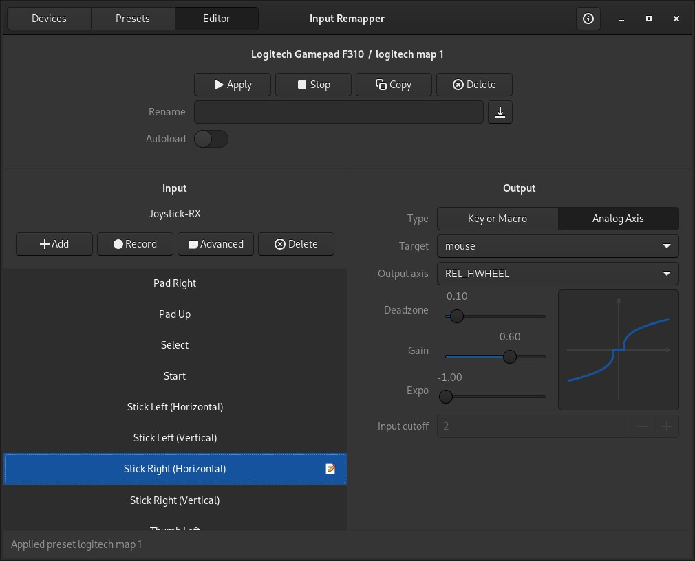

## Mappings for Logitech F310

This is a configuration that can be applied to a `Logitech F310`:

This is meant for controlling a linux system.

Can be suitable for light browsing or navigation.

It works through [input-remapper](https://github.com/sezanzeb/input-remapper):

There's an `AUR` package [here](https://aur.archlinux.org/packages/input-remapper-git).

Remember to `sudo systemctl start input-remapper` after installation.

Then launch `input-remapper-gtk` in a terminal.

---

The `json` file should be placed here:

 `~/.config/input-remapper-2/presets/Logitech Gamepad F310`

---

## Configuration

This is the current configuration but you can change it as you see fit.

It includes some shortcuts I use in my `wm` which might not be relevant to yours.

---

**Stick Left:** Move mouse cursor

**Stick Right:** Vertical and horizontal wheel scrolling

---

**Button Left:** Click

**Button Down:** Right Click

**Button Up:** Middle Click

**Button Right:** Mod Button (See below)

---

**Pad Left:** Audio Prev

**Pad Right:** Audio Next

**Pad Up:** Volume Up

**Pad Down:** Volume Down

---

**Top Left:** Previous Tag

**Top Right:** Next Tag

---

**Trigger Left:** Go To Top

**Trigger Right:** Go To Bottom

---

**Thumb Left:** Move cursor to next screen

**Thumb Right:** Refresh (F5)

---

**Select:** Play/Pause music

**Start:** Lock screen

**Mode:** Toggle maximize on window under cursor

---

## Mod Button

`Button Right` is a button that can be used with other buttons for further mappings.

I'll refer to it as `Mod`.

---

**Mod + Pad Up:** Zoom In

**Mod + Pad Down:** Zoom Out

**Mod + Pad Left:** Go Back

**Mod + Pad Right:** Go Forward

**Mod + Top Left:** Esc Key

---

## Hints

If `input-remapper` is not detecting the device after installation, try re-plugging the controller and restart the program.

`input-remapper-gtk` might periodically stop working while you're editing buttons because it loses root access, you're supposed to input the password again in the terminal where you run it.